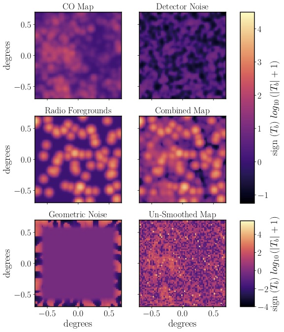
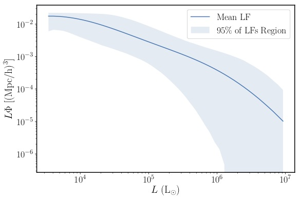
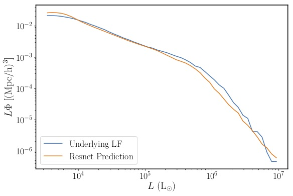
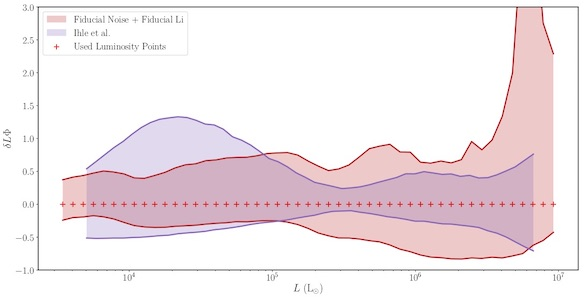

# intensitymap_cnn
## Line Intensity Mapping with Neural Networks

Intensitymap CNN is a set of code to train and test CNNs on their ability to learn underlying luminosity functioons from line intensity maps (LIMs).  It makes use of [Limlam Mocker](https://github.com/georgestein/limlam_mocker) to generate mock CO line intensity maps from Peak Patch Halo Catalogs.  [NumPy](https://www.numpy.org/), [SciPy](https://www.scipy.org/), [Tensorflow](https://www.tensorflow.org/) and [Scikit](https://scikit-image.org/) are required for training the CNN and [matplotlib](https://matplotlib.org/) is required for analyzing the CNN performance.  Although anyone is welcome to use this to train CNNs it was meant for use in [arXiv:1905.XXXXX](www.arxig.org) and not for general use.

The first goal was to create a set of mock LIMs and corresponding luminosity functions to train on.  Making use of the [Peak Patch Method](https://arxiv.org/abs/1810.07727) we generate large dark matter catalogs.  With the dark matter catalogs and a [Li model of CO luminosity from halo mass](https://arxiv.org/abs/1503.08833) we generate the mock LIMs and luminosity functions.  We also inlude in both noise and foregrounds into our LIMs when training.  Our pixel size is smaller then what is expected for experiments so we use beam smoothing.  The figure below shows the first slice of a different maps.

Below is a figure showing the range of luminosity functions that the CNN is expected to learn (i.e. these were the training set expected output).

The CNN is expected to take in a 64x64x10 modified LIM and to output 49 values that correspond to the value of the luminosity function at different luminosities.  Below is a prediction of the CNN on a LIM v.s. the underlying luminosity function

Below is a comparision of the CNN to a power spectrum / voxel intensity distrubtion method of determing the luminosity function.  The CNN does better at lower luminosities.

